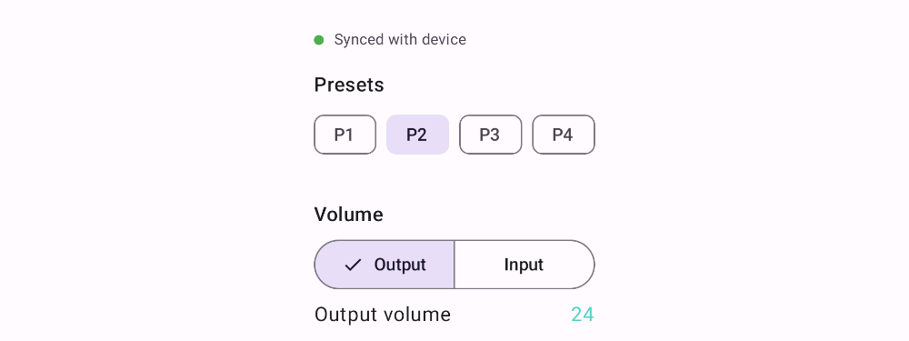

# mosconi-bt

An unofficial, modern replacement for MOSCONI's "Mos_DSP_control_App" — the Android app
used to control MOSCONI PICO-series car-audio DSPs (tested against a PICO V2 6|8) over
Bluetooth. Native Kotlin + Jetpack Compose, Material 3 sliders instead of drag-image
controls, support for any screen size (including split-screen and unusually wide/short
displays), and — unlike the factory app — it actually **reads the DSP's live state**,
so it stays in sync with a physical volume/sub-level knob or another controller
instead of just blindly overwriting whatever's on the device.

## Why this exists

The factory app hasn't been updated in years, its UI (drag-and-drop image sliders) is
unpleasant to use, and it can't read anything back from the DSP — if you have a
physical knob wired up, the app has no idea what it's set to until you touch every
slider yourself. MOSCONI doesn't publish the Bluetooth protocol, so this project
reverse-engineered it by decompiling both the factory Android app (for the write side)
and the official Windows tuning GUI (for the read side, which the Android app never
had). See [PROTOCOL.md](PROTOCOL.md) for the full writeup, including which parts are
verified vs. still assumptions.

## Screenshots

Real renders of the actual Compose UI (via [Paparazzi](https://github.com/cashapp/paparazzi),
not mockups) — see [Screenshots](#regenerating-screenshots) below for how to reproduce/update these.

| Connect | Control (light) | Control (dark) |
|---|---|---|
|  |  |  |

On an unusually wide/short screen (e.g. a fixed car head unit), content width is capped to
the screen height instead of stretching sliders edge-to-edge:



## Project layout

- **`:protocol`** — pure Kotlin/JVM module with no Android dependency. Contains
  `MosconiProtocol.kt`, the packet-building logic reverse-engineered from the factory
  app, plus unit tests. Buildable and testable with plain Gradle + Maven Central; no
  Android SDK required.
- **`:app`** — the Android application: Compose UI, classic-Bluetooth (RFCOMM/SPP)
  transport, and a small ViewModel wiring the two together. Also has
  [Paparazzi](https://github.com/cashapp/paparazzi) screenshot tests
  (`app/src/test/kotlin/.../ScreenshotTest.kt`) that render key screens headlessly
  (no emulator needed) and compare against the golden images above on every CI run.

## Building

```
./gradlew :protocol:test          # pure-JVM protocol logic + tests, no Android SDK needed
./gradlew :app:assembleDebug      # needs the Android SDK + Google's Maven repo
./gradlew :app:verifyPaparazziDebug   # screenshot regression tests, needs the Android SDK
```

Every push and PR also runs in [GitHub Actions](.github/workflows/build.yml), which
builds a debug APK you can download from the run's Artifacts tab without building
locally at all.

### Regenerating screenshots

After a UI change, update the golden images with:

```
./gradlew :app:recordPaparazziDebug
```

and commit the changed PNGs under `app/src/test/snapshots/images/`.

Open the project root in Android Studio (Koala or newer) and it will pick up both
modules automatically. `:app` needs `compileSdk 34` / a recent Android SDK installed
via Android Studio's SDK Manager.

> **Build status:** `./gradlew :protocol:test`, `./gradlew :app:assembleDebug`, and
> `./gradlew :app:verifyPaparazziDebug` have all been run end-to-end against a real
> Android SDK (platform 34 / build-tools 34.0.0) and pass — including the CRC-8
> implementation against its standard reference check value, and the resulting
> `app-debug.apk` inspected with `aapt dump badging` to confirm the package name,
> permissions, and min/target SDK. It has **not** been installed on a device or
> connected to real hardware yet, so functional behavior (pairing, sending commands,
> the actual over-the-air status-poll round trip, and the flagged protocol assumptions
> above) is still unverified.

## Setting up the DSP

1. Pair the DSP's Bluetooth module with your phone the normal way, in Android's
   Bluetooth settings (it should show up with a name containing "MOSCONI").
2. Open the app, grant the Bluetooth permission when asked, and tap the paired device
   to connect.

## Known unknowns — verify against real hardware

Static analysis of the decompiled apps tells you *what bytes get sent/parsed*, not
everything about how the DSP behaves. A few things are flagged in `MosconiProtocol.kt`
as assumptions to check the first time you use this against a real unit — see
[PROTOCOL.md § Confidence & open questions](PROTOCOL.md#confidence--open-questions)
for the current list (volume slider direction, and whether the status response's
"page toggle" bit truly alternates on its own). All are one-line fixes once confirmed.

## Contributing back

The current feature set covers what both the Android app (write) and the Windows GUI
(read) exposed for: output/input volume, sub level, balance/fader, 4 presets, and
treble/mid/bass. The Windows GUI's own memory-mapped bulk-read mechanism
(`USERDATA_LOAD`, see PROTOCOL.md) covers a lot more than that — crossovers, a
per-channel mixer matrix, effects, time alignment, etc. — none of which this app reads
or writes. If you want one of those and can help pin down its exact byte offset/format
(either from further static analysis or a live capture), please open an issue/PR.

If you capture a Bluetooth HCI snoop log (Android Developer Options → "Enable
Bluetooth HCI snoop log") while operating either official app, or a serial capture of
the Windows GUI talking over USB, and it reveals something this app gets wrong, that's
exactly the kind of ground-truth this project is missing — please share it.
