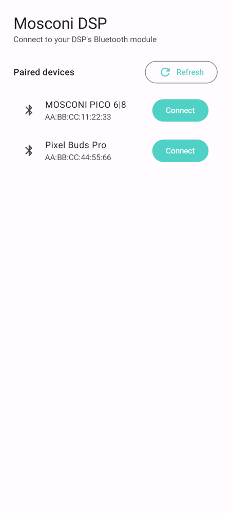
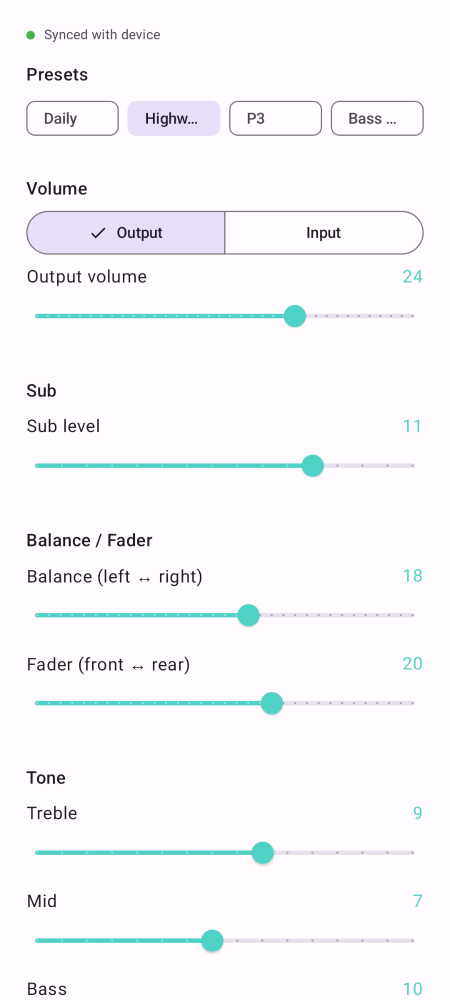
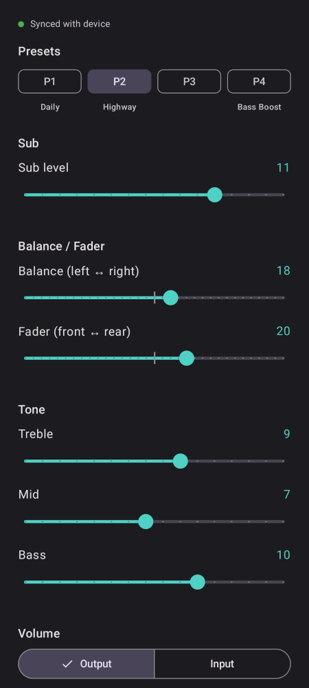
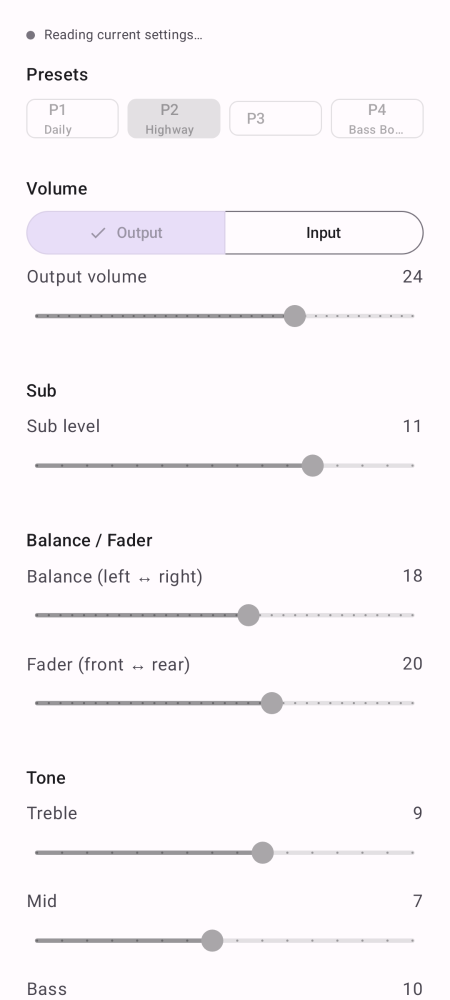
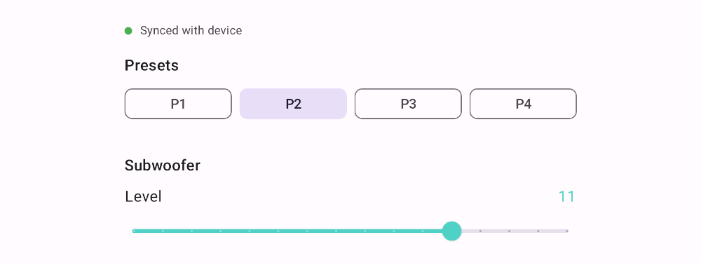

# mosconi-bt

An unofficial, modern replacement for MOSCONI's "Mos_DSP_control_App" — the Android app
used to control MOSCONI PICO-series car-audio DSPs (tested against a PICO V2 6|8) over
Bluetooth. Native Kotlin + Jetpack Compose, Material 3 sliders instead of drag-image
controls, support for any screen size (including split-screen and unusually wide/short
displays), and — unlike the factory app — it actually **reads the DSP's live state**,
so it stays in sync with a physical volume/sub-level knob or another controller
instead of just blindly overwriting whatever's on the device.

## Why this exists

The factory app hasn't been updated in years, its UI (drag-and-drop image sliders) is
unpleasant to use, and it can't read anything back from the DSP — if you have a
physical knob wired up, the app has no idea what it's set to until you touch every
slider yourself. MOSCONI doesn't publish the Bluetooth protocol, so this project
reverse-engineered it by decompiling both the factory Android app (for the write side)
and the official Windows tuning GUI (for the read side, which the Android app never
had). See [PROTOCOL.md](PROTOCOL.md) for the full writeup, including which parts are
verified vs. still assumptions.

## Screenshots

Real renders of the actual Compose UI (via [Paparazzi](https://github.com/cashapp/paparazzi),
not mockups) — see [Screenshots](#regenerating-screenshots) below for how to reproduce/update these.

| Connect | Control (light) | Control (dark) | Control (read-only, before first sync) |
|---|---|---|---|
|  |  |  |  |

Controls stay disabled (and read-only) from the moment you connect until the app has
successfully read the DSP's real values at least once — editing before that would mean
guessing from restored preferences or hardcoded defaults, and could silently overwrite
whatever the device actually had. Once synced, editing a control pauses applying new
reads for a few seconds (extended for as long as you keep dragging), so an in-flight
poll response can't yank a slider back to the old value mid-adjustment.

On an unusually wide/short screen (e.g. a fixed car head unit), content width is capped
at 520dp instead of stretching sliders edge-to-edge:



## Project layout

- **`:protocol`** — pure Kotlin/JVM module with no Android dependency. Contains
  `MosconiProtocol.kt`, the packet-building logic reverse-engineered from the factory
  app, plus unit tests. Buildable and testable with plain Gradle + Maven Central; no
  Android SDK required.
- **`:app`** — the Android application: Compose UI, classic-Bluetooth (RFCOMM/SPP)
  transport, and a small ViewModel wiring the two together. Also has
  [Paparazzi](https://github.com/cashapp/paparazzi) screenshot tests
  (`app/src/test/kotlin/.../ScreenshotTest.kt`) that render key screens headlessly
  (no emulator needed) and compare against the golden images above on every CI run.

## Building

```
./gradlew :protocol:test          # pure-JVM protocol logic + tests, no Android SDK needed
./gradlew :app:assembleDebug      # needs the Android SDK + Google's Maven repo
./gradlew :app:verifyPaparazziDebug   # screenshot regression tests, needs the Android SDK
```

Every push and PR also runs in [GitHub Actions](.github/workflows/build.yml), which
builds a debug APK you can download from the run's Artifacts tab without building
locally at all.

### Regenerating screenshots

After a UI change, update the golden images with:

```
./gradlew :app:recordPaparazziDebug
```

and commit the changed PNGs under `app/src/test/snapshots/images/`.

### Building a release APK

Debug builds (above) are unminified and signed with the shared, checked-in
`debug.keystore` — fine for day-to-day sideloading, but noticeably larger than
necessary (nothing shrinks unused code/resources out of the dependencies) and not
signed with a key you actually control.

```
./gradlew :app:assembleRelease
```

turns on R8 minification and resource shrinking — no extra ProGuard rules needed,
nothing in this app relies on reflection, so the defaults plus what AndroidX/Compose
ship in their own consumer rules are enough (confirmed by inspecting
`app/build/outputs/mapping/release/` for missing-rule warnings after a clean build:
none). It shrinks the APK from ~22MB down to under 2MB.

To get a *signed*, directly installable APK out of that instead of
`app-release-unsigned.apk`, generate your own release keystore once — **do not** reuse
`debug.keystore` for this:

```
keytool -genkeypair -v -keystore mosconi-bt-release.keystore -alias mosconi-bt \
  -keyalg RSA -keysize 2048 -validity 10000
```

then add these four keys to your own `local.properties` (already gitignored, sits
alongside the `sdk.dir` Android Studio puts there — never commit a real release
keystore or its passwords):

```
release.storeFile=/absolute/path/to/mosconi-bt-release.keystore
release.storePassword=...
release.keyAlias=mosconi-bt
release.keyPassword=...
```

`./gradlew :app:assembleRelease` then produces a signed
`app/build/outputs/apk/release/app-release.apk`, installable like any other APK
(`adb install`, or just copying it to the phone). Without those four keys set, the
same command still succeeds but leaves the output unsigned instead of failing.

**Back up that keystore and its passwords somewhere safe.** Android refuses to install
an update signed with a different key over an existing install, so losing it means
every future release is a fresh reinstall (losing all local prefs) rather than an
in-place update — there's no recovery path if it's gone.

### Building a signed release APK via GitHub Actions

The [Release workflow](.github/workflows/release.yml) does the same
`:app:assembleRelease` build above, but on a GitHub-hosted runner instead of your own
machine - handy if you'd rather not keep an Android SDK installed locally. It's
manual-only (`workflow_dispatch`), never runs on a push, and only ever uploads a build
artifact to that one workflow run - it doesn't publish anywhere.

One-time setup, using the same keystore from the section above:

1. Base64-encode the keystore file: `base64 -w0 mosconi-bt-release.keystore` (Linux) or
   `base64 -i mosconi-bt-release.keystore` (macOS).
2. In the repo's **Settings → Secrets and variables → Actions**, add four repository
   secrets: `RELEASE_KEYSTORE_BASE64` (the output of step 1),
   `RELEASE_KEYSTORE_PASSWORD`, `RELEASE_KEY_ALIAS`, `RELEASE_KEY_PASSWORD` - the same
   values as the `local.properties` keys above.

Then, from the **Actions** tab, select **Release** → **Run workflow**. The signed
`app-release.apk` shows up under that run's **Artifacts** once it finishes (kept for 90
days). The keystore only ever exists on the ephemeral runner's disk for the duration of
that one job; nothing is written back to the repo.

Open the project root in Android Studio (Koala or newer) and it will pick up both
modules automatically. `:app` needs `compileSdk 34` / a recent Android SDK installed
via Android Studio's SDK Manager.

> **Build status:** `./gradlew :protocol:test`, `./gradlew :app:assembleDebug`, and
> `./gradlew :app:verifyPaparazziDebug` have all been run end-to-end against a real
> Android SDK (platform 34 / build-tools 34.0.0) and pass — including the CRC-8
> implementation against its standard reference check value, and the resulting
> `app-debug.apk` inspected with `aapt dump badging` to confirm the package name,
> permissions, and min/target SDK. It has **not** been installed on a device or
> connected to real hardware yet, so functional behavior (pairing, sending commands,
> the actual over-the-air status-poll round trip, and the flagged protocol assumptions
> above) is still unverified.

## Setting up the DSP

1. Pair the DSP's Bluetooth module with your phone the normal way, in Android's
   Bluetooth settings (it should show up with a name containing "MOSCONI").
2. Open the app, grant the Bluetooth permission when asked, and tap the paired device
   to connect.

From then on, opening the app auto-connects to that same device, so you don't have to
pick it every time — tap **Cancel** on the "Connecting automatically…" banner if you'd
rather stop and pick a different one instead. The serial (RFCOMM) session, and the
1-second status polling that rides on it, is torn down the moment the app leaves the
foreground (backgrounded, screen off, task-switched away) and re-established when you
come back — it doesn't sit connected to the DSP in the background.

If you've renamed presets in the Windows tuning GUI ("Sport", "Highway", etc.), those
names show up on the P1–P4 chips here too — read-only, this app has no UI to rename
them, only to display what's already on the device.

## Known unknowns — verify against real hardware

Static analysis of the decompiled apps tells you *what bytes get sent/parsed*, not
everything about how the DSP behaves. A few things are flagged in `MosconiProtocol.kt`
as assumptions to check the first time you use this against a real unit — see
[PROTOCOL.md § Confidence & open questions](PROTOCOL.md#confidence--open-questions)
for the current list (volume slider direction, and whether the status response's
"page toggle" bit truly alternates on its own). All are one-line fixes once confirmed.

## Contributing back

The current feature set covers what both the Android app (write) and the Windows GUI
(read) exposed for: output/input volume, sub level, balance/fader, 4 presets, and
treble/mid/bass. The Windows GUI's own memory-mapped bulk-read mechanism
(`USERDATA_LOAD`, see PROTOCOL.md) covers a lot more than that — crossovers, a
per-channel mixer matrix, effects, time alignment, etc. — none of which this app reads
or writes. If you want one of those and can help pin down its exact byte offset/format
(either from further static analysis or a live capture), please open an issue/PR.

If you've set a PIN in the Windows GUI, you may notice this app doesn't ask for it —
that's expected, not a gap. The PIN only locks a handful of whole-device operations
(loading/writing a full setup file, the Setup Wizard's write step) that this app never
performs; the day-to-day controls it does expose aren't PIN-gated at all. See
[PROTOCOL.md § PIN protection](PROTOCOL.md#pin-protection-not-implemented--local-windows-gui-lock-not-a-dsp-control-lock)
for the full writeup.

If you capture a Bluetooth HCI snoop log (Android Developer Options → "Enable
Bluetooth HCI snoop log") while operating either official app, or a serial capture of
the Windows GUI talking over USB, and it reveals something this app gets wrong, that's
exactly the kind of ground-truth this project is missing — please share it.

## License

[MIT](LICENSE). This is an independent, unofficial project, not affiliated with,
endorsed by, or supported by MOSCONI/Gladen — "MOSCONI" and related names/marks belong
to their respective owners. Everything in this repository (code and documentation) is
this project's own original work; the protocol it implements was learned by observing
the official apps' behavior for interoperability, not by copying their code, and no
MOSCONI code or assets are included here.
